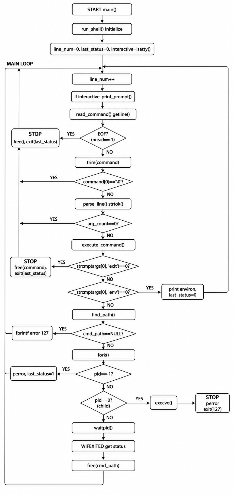

# Simple Shell

this project is a simple unix shell implementation in C.

## Description

"hsh" is a basic command-line interpreter to executes commands of the user. there is :
- interactive and non-interactive modes
- built-in commands: "exit" , "env"
- external command execution via PATH lookup
- Proper error handling and status codes

## Features

- **Interactive mode**: Display a prompt "#cisfun$" when running in a terminal
- **Non-interactive mode**: Reads commands from stdin
- **PATH lookup**: Automatically searches for executables in PATH directories
- **Absolute/relative paths**: support direct execution with "/" or "./" paths
- **Environment access**: "env" command displays all environment variables
- **Clean exit**: "exit" command terminates the shell with proper status code

## Compilation

in bash : gcc -Wall -Werror -Wextra -pedantic -std=gnu89 *.c -o hsh

## Usage

### Interactive mode

```bash
./hsh
#cisfun$ /bin/ls
#cisfun$ env
#cisfun$ exit
```

### Non-interactive mode

```bash
echo "/bin/ls" | ./hsh
cat commands.txt | ./hsh
./hsh < input.txt
```

## Built-in Commands

| Command | Description |

| `exit`  | Exit the shell |
| `env`   | Print all environment variables |

## File Structure and Functions

### `main.c` (1 function)

Entry point of the shell.

| Function | Description |

| `main()` | Shell entry point, calls `run_shell()` and returns 0 on success |

---

### `shell.c` (5 functions)

Main shell logic and command execution.

| Function | Description |

| `execute_builtin()` | Handles built-in commands (`exit`, `env`). Returns -1 for exit, 1 for env executed, 0 otherwise |
| `execute_external()` | Executes external commands via `fork()` and `execve()`. Handles PATH lookup and error reporting |
| `execute_command()` | Main command dispatcher. Calls `execute_builtin()` first, then `execute_external()` if not a builtin |
| `parse_line()` | Tokenizes a command line into arguments using `strtok()`. Stores up to 1023 arguments |
| `run_shell()` | Main shell loop. Initializes variables and runs the infinite loop until exit or EOF |

---

### `shell_loop.c` (3 functions)

Helper functions for the shell loop.

| Function | Description |

| `wait_for_child()` | Waits for child process to terminate using `waitpid()`. Updates last_status with exit code |
| `print_prompt()` | Displays the interactive prompt `#cisfun$ ` and flushes stdout |
| `read_command()` | Reads a line from stdin using `getline()`. Handles EOF and removes trailing newline |

---

### `utils.c` (3 functions)

General utility functions.

| Function | Description |

| `trim()` | Removes leading and trailing spaces/tabs from a string (in-place modification) |
| `get_path_env()` | Searches the environment for the PATH variable and returns its value |
| `build_full_path()` | Constructs a full path by concatenating directory + `/` + command name |

---

### `path_utils.c` (3 functions)

PATH lookup and command resolution.

| Function | Description |

| `check_absolute_path()` | Checks if command starts with `/` or `.`. Returns allocated path if executable |
| `search_in_path()` | Iterates through PATH directories using `strtok()`. Returns first matching executable |
| `find_path()` | Main PATH lookup function. Calls `check_absolute_path()` first, then `search_in_path()` |

---

### `shell.h` (header file)

Header file with all function prototypes and includes.

| Content | Description |

| Header guards | `#ifndef SHELL_H`, `#define SHELL_H`, `#endif` |
| Standard includes | `stdio.h`, `stdlib.h`, `unistd.h`, `sys/wait.h`, `string.h` |
| External declaration | `extern char **environ` for environment access |
| Function prototypes | All functions from the 4 .c files declared for cross-file usage |

---

## File Organization Summary
.
├── main.c # Entry point (1 function)
|
├── shell.c # Main shell logic (5 functions)
|
├── shell_loop.c # Shell loop helpers (3 functions)
|
├── utils.c # Utility functions (3 functions)
|
├── path_utils.c # PATH lookup functions (3 functions)
|
├── shell.h # Header file with prototypes
|
└── README.md # This documentation file

text

**Total: 15 functions across 5 source files**

## Error Handling

- Command not found: exits with status `127`
- Execution error: exits with status `1`
- Successful execution: returns the exit status of the executed command

## Requirements

- GCC compiler with `-std=gnu89`
- Unix-like operating system (tested on Ubuntu 20.04 LTS)
- Standard C libraries: `stdio.h`, `stdlib.h`, `unistd.h`, `sys/wait.h`, `string.h`

## Coding Style

This project follows the [Betty coding style](https://github.com/holbertonschool/Betty) guidelines:
- Maximum 5 functions per file ✅
- Maximum 40 lines per function ✅
- Proper documentation comments ✅
- No memory leaks ✅
- Header files include guarded ✅

## Example Session

```bash
$ ./hsh
#cisfun$ /bin/ls
hsh main.c shell.c test_ls_2
#cisfun$ echo "Hello, World!"
Hello, World!
#cisfun$ env
PATH=/usr/bin:/bin
HOME=/home/user
...
#cisfun$ qwerty
./hsh: 4: qwerty: not found
#cisfun$ exit
$
```

## Authors

- Théo GOLIK & Raider Del Castillo Abalos

## Flowchart


